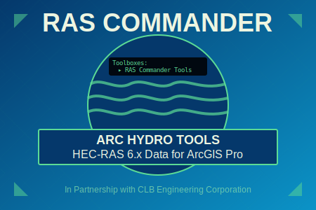
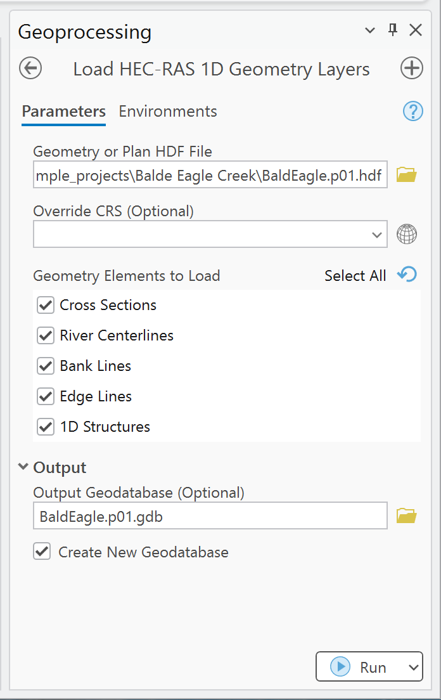
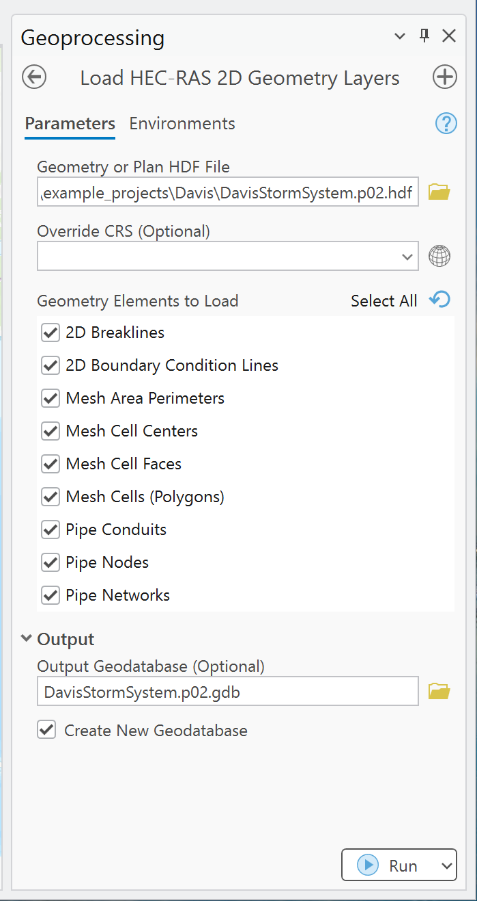
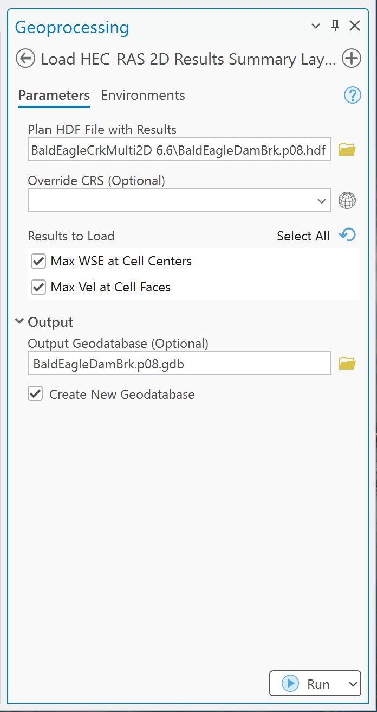
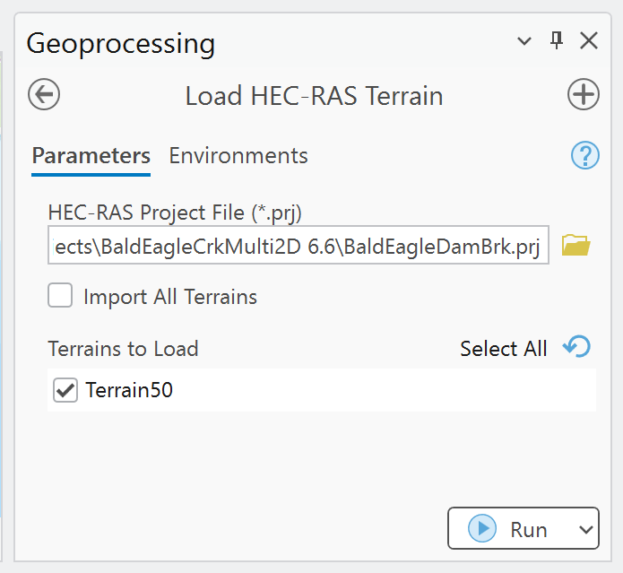
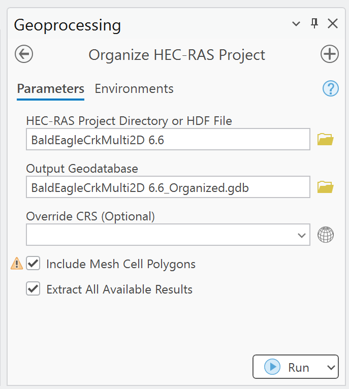
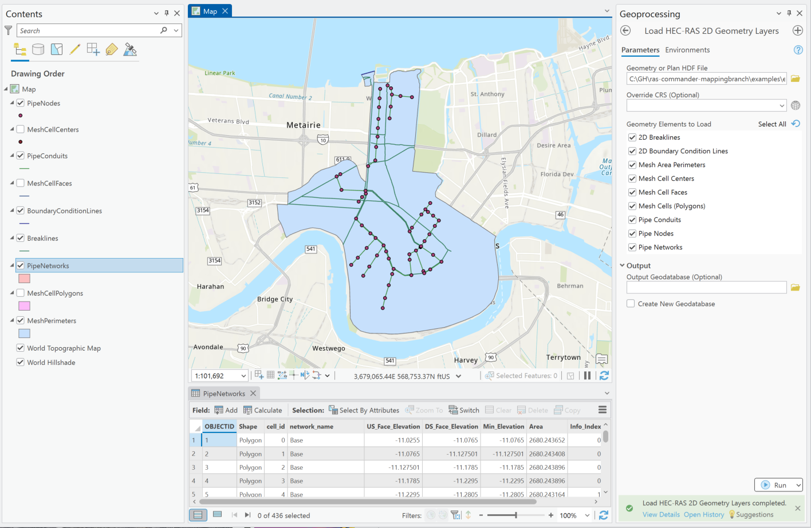
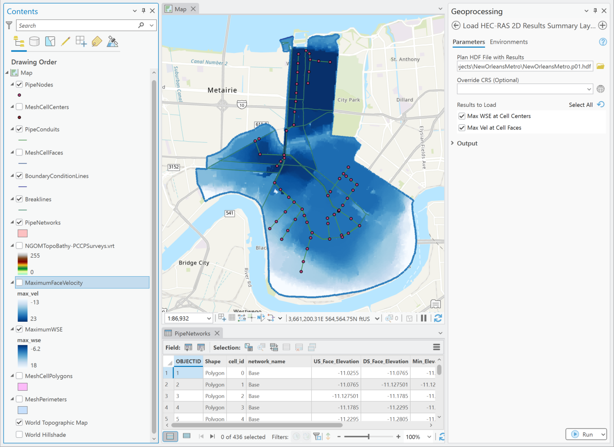
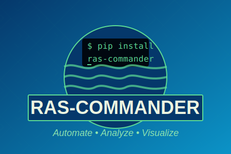

# RAS Commander Arc Hydro Tools

<div align="center">
  

[](LICENSE)
[](https://www.esri.com/en-us/arcgis/products/arcgis-pro/overview)
[](https://www.hec.usace.army.mil/software/hec-ras/)

**Bringing HEC-RAS 6.x Direct Data Access to ArcGIS**

### 🎉 Launching at Esri User Conference 2025 🎉

[CLB Engineering](https://clbengineering.com/) | [RAS Commander Library](https://github.com/gpt-cmdr/ras-commander) | [Arc Hydro](https://www.esri.com/en-us/industries/water-resources/arc-hydro)

</div>

---

## Partnership Announcement

**ESRI has partnered with CLB Engineering Corporation's William "Bill" Katzenmeyer**, Vice President and creator of the RAS Commander Open Source Python Library, to bring powerful HEC-RAS 6.x HDF5 data extraction capabilities directly into ArcGIS Pro through the Arc Hydro Tools framework.

This collaboration represents a groundbreaking application of **LLM Forward engineering**—using Large Language Models to rapidly develop sophisticated geospatial tools that bridge hydraulic modeling and GIS workflows.

### 🚀 From Concept to Conference in One Month

Following an ASFPM brainstorming session in late May 2025, this toolbox was developed using CLB's innovative LLM Forward approach, achieving production‑ready functionality in just over a month—demonstrating the transformative potential of AI‑assisted development in the water‑resources sector.

---

## Overview

**RAS Commander Arc Hydro Tools** enables hydraulic engineers and GIS professionals to seamlessly extract and visualize HEC‑RAS 1D and 2D geometry, terrain, and results data without manual conversion steps. This free and open‑source toolbox brings the power of the [RAS Commander library](https://github.com/gpt-cmdr/ras-commander) directly into ArcGIS Pro.

### Key Features

* 📊 **Direct HDF5 Import** – Load HEC‑RAS data directly from geometry (`g*.hdf`) and plan (`p*.hdf`) files
* 🗺️ **1D Geometry Support** – Extract cross sections, river centerlines, bank lines, and structures
* 🌊 **2D Geometry Support** – Import mesh elements, breaklines, boundary conditions, and cell polygons
* 🏗️ **Pipe Networks** – Full support for storm/sewer pipe networks including SWMM imports
* 📈 **Results Visualization** – Display maximum WSE and velocity results with time of occurrence
* ⛰️ **Terrain Loading** – Import HEC‑RAS terrain layers from RAS Mapper VRT files
* 🗂️ **Project Organization** – Batch process entire HEC‑RAS projects into organized geodatabases

<div align="center">
  <a href="https://clbengineering.com/">
    
  </a>

*Developed by [CLB Engineering](https://clbengineering.com/) in partnership with ESRI*

</div>

---

## Installation

### Primary Method: Install with Arc Hydro Tools

The RAS Commander toolbox will be included as part of the Arc Hydro Tools distribution. This is the recommended installation method for most users.

1. Install Arc Hydro Tools with the [Arc Hydro installer](https://www.esri.com/en-us/industries/water-resources/arc-hydro/downloads)
2. If you are updating, uninstall Arc Hydro and re-install the latest version (Version 3.4.30 minimum)
3. The RAS Commander toolbox will be available under:

   ```
   Toolboxes → Arc Hydro Tools → RAS Commander
   ```

Note that these toolboxes have only been tested in ArcGIS, not the older ArcMap.  

Development install is detailed further in case you want to edit the tools or extend them, or get the latest bleeding-edge version between Arc Hydro updates.

---

## 📸 Interface Walk‑Through

Below are high‑resolution screenshots of each Arc Hydro tool in action to help you get up to speed quickly.

### Load HEC‑RAS 1D Geometry Layers

<p align="center">
  
</p>

---

### Load HEC‑RAS 2D Geometry Layers

<p align="center">
  
</p>

---

### Load HEC‑RAS 2D Results Summary Layers

<p align="center">
  
</p>

---

### Load HEC‑RAS Terrain

<p align="center">
  
</p>

---

### Organize HEC‑RAS Project

<p align="center">
  
</p>

---

### Full 2D Model Example — New Orleans HEC Example Project

<p align="center">
  
</p>

<p align="center">
  
</p>

These images showcase a 2D HEC‑RAS model of the New Orleans metro storm‑water system, complete with pipe networks, mesh polygons, and a maximum WSEL raster generated directly inside ArcGIS Pro.

---

## Community‑Driven Development

This is a **community‑driven effort**, and we're actively seeking your feedback!

### Are you a...

* 🏛️ **Municipality** looking to integrate HEC‑RAS data into dashboards?
* 👷 **Engineer** communicating multi‑hazard flood risk?
* 🗺️ **GIS Professional** preparing 2D model data?
* 🔬 **Researcher** analyzing model results?

**We want to hear from you!** [Share your ideas and use cases](https://github.com/gpt-cmdr/ras-commander-hydro/issues)

---

## The LLM Forward Revolution

This project showcases CLB Engineering's [LLM Forward approach](https://clbengineering.com/)—a revolutionary methodology that leverages Large Language Models to accelerate software development while maintaining professional‑grade quality. Learn more about this innovative approach and the author's work at [Engineering with LLMs](https://engineeringwithllms.info/).

### What Makes This Special?

1. **Rapid Development**: From concept to production in just over a month
2. **Cross‑Domain Expertise**: Seamlessly bridges hydraulic engineering and GIS
3. **Community Focused**: Built with user feedback at its core
4. **Open Source**: Transparent development process you can contribute to

---

### Development Installation

For developers and users who want to extend or customize the tools:

1. **Clone the Repository**

   ```bash
   git clone https://github.com/gpt-cmdr/ras-commander-hydro.git
   cd ras-commander-hydro
   ```

2. **Option A: Add Toolbox in ArcGIS Pro**

   * Open ArcGIS Pro
   * In the Catalog pane, right‑click on **Toolboxes**
   * Select **Add Toolbox**
   * Navigate to `toolboxes/RAS-Commander.pyt`

3. **Option B: Install for Development (Requires Admin)**

   ```powershell
   # Run PowerShell as Administrator
   cd Resources
   .\install_toolbox.ps1
   ```

   To uninstall:

   ```powershell
   # Run PowerShell as Administrator
   cd Resources
   .\uninstall_toolbox.ps1
   ```

---

## Tools Overview

### 🔧 Load HEC‑RAS 1D Geometry Layers

Extract comprehensive 1D hydraulic model elements for report figures and analysis.

### 🌐 Load HEC‑RAS 2D Geometry Layers

Import complete 2D model components including mesh cells as polygons for advanced spatial analysis.

### 📊 Load HEC‑RAS 2D Results Summary Layers

Visualize maximum water‑surface elevation and velocity results with temporal data.

### ⛰️ Load HEC‑RAS Terrain

Import terrain layers from RAS Mapper with proper georeferencing.

### 🗂️ Organize HEC‑RAS Project

Comprehensive batch‑processing tool for entire HEC‑RAS projects.

---

## Current Capabilities & Roadmap

### Initial Release Features

* ✅ 1D and 2D Geometry Extraction (Including Pipe Networks!)
* ✅ Max WSE and Velocity as 2D Mesh Results
* ✅ Terrain Import for Inundation Mapping
* ✅ Support for HEC‑RAS 2D Models
* ✅ Organize Entire Projects as Geodatabases

### Coming Soon

* 📊 **Improved Schemas & Layer Styling**
* 📈 **1D Results & Full Time Series**
* 🌊 **Fluvial/Pluvial Delineation**
* 📍 **Land Use Layer Integration**
* 🔄 **Sync Changes Back to HEC‑RAS**
* 🎯 **Community‑Requested Features**

[View Full Roadmap & Vote on Features](https://github.com/gpt-cmdr/ras-commander-hydro/issues)

---

## Get Involved

### Webinar This Fall!

Join us for an in‑depth webinar showcasing advanced workflows and new features.

### Contributors Welcome!

Visit our [GitHub Repository](https://github.com/gpt-cmdr/ras-commander-hydro) to:

* Report issues
* Suggest features
* Submit pull requests
* Share your use cases

---

## Resources & Links

* **RAS Commander Arc Hydro Tools**: [https://github.com/gpt-cmdr/ras-commander-hydro](https://github.com/gpt-cmdr/ras-commander-hydro)
* **RAS Commander Library**: [https://github.com/gpt-cmdr/ras-commander](https://github.com/gpt-cmdr/ras-commander)
* **CLB Engineering Corporation**: [https://clbengineering.com/](https://clbengineering.com/)
* **Engineering with LLMs**: [https://engineeringwithllms.info/](https://engineeringwithllms.info/)

---

## License

This project is licensed under the MIT License – see the [LICENSE](LICENSE) file for details.

## Acknowledgments

* **[ESRI](https://www.esri.com/)** – Partnership and Arc Hydro Tools integration
* **[CLB Engineering](https://clbengineering.com/)** – Project sponsor and LLM Forward methodology
* **[USACE HEC](https://www.hec.usace.army.mil/)** – HEC‑RAS software and Example Projects
* **Water Resources Community** – For invaluable feedback and use cases

---

<div align="center">
  

**Transform Your HEC‑RAS Workflow Today**

### 🎉 See us at Esri User Conference 2025! 🎉

[Get Started](https://github.com/gpt-cmdr/ras-commander-hydro) | [Documentation](Doc/RASCommander_Help.html) | [Report Issues](https://github.com/gpt-cmdr/ras-commander-hydro/issues)

</div>
