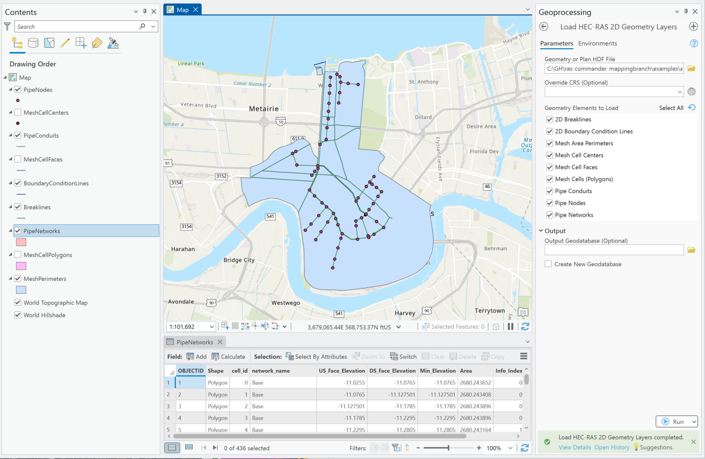
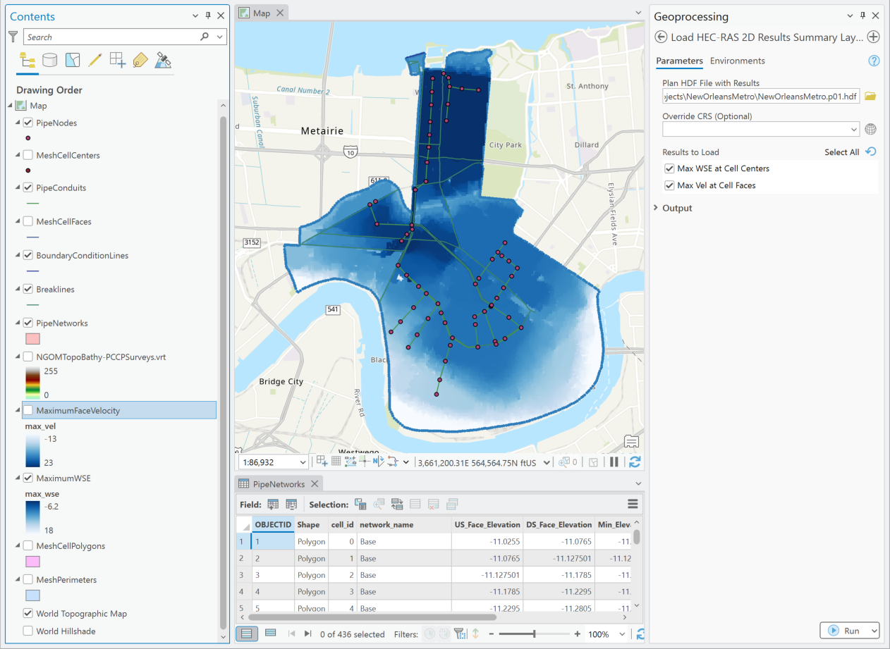

# Choose a Tool

Use an individual loader when you need a specific layer from one HDF file. Use **Organize
HEC-RAS Project** when you want a consistent geodatabase for all available plans in one folder.

| Need | Tool | Input | Main output |
| --- | --- | --- | --- |
| Review a 1D river model | [Load 1D geometry](tools/load-1d-geometry.md) | `g*.hdf` or `p*.hdf` | Polyline feature classes |
| Review a 2D mesh or pipe network | [Load 2D geometry](tools/load-2d-geometry.md) | `g*.hdf` or `p*.hdf` | Points, lines, and polygons |
| Map peak 2D WSE or velocity | [Load 2D results](tools/load-2d-results.md) | Computed `p*.hdf` | Summary point feature classes |
| Display the base RAS terrain | [Load terrain](tools/load-terrain.md) | Project `.prj` plus `.rasmap` and VRT files | Raster layers in the active map |
| Build one organized delivery | [Organize a project](tools/organize-project.md) | Project folder or one HDF | File geodatabase grouped by plan |

## Load HEC-RAS 1D Geometry Layers

Extract cross sections, river centerlines, bank lines, edge lines, and supported 1D structures.
The default selection is cross sections and river centerlines.

[Open the 1D geometry guide](tools/load-1d-geometry.md)

## Load HEC-RAS 2D Geometry Layers

Extract flow-area perimeters, mesh centers, faces or polygons, breaklines, boundary-condition
lines, and supported pipe-network geometry. The default selection is mesh-area perimeters.

[Open the 2D geometry guide](tools/load-2d-geometry.md)

## Load HEC-RAS 2D Results Summary Layers

Create maximum WSE points at cell centers and maximum velocity points at cell-face centroids.
Values remain in the HEC-RAS model's units; the tool does not convert or classify them.

[Open the 2D results guide](tools/load-2d-results.md)

## Load HEC-RAS Terrain

Read terrain definitions from the project's `.rasmap` file and add the corresponding VRTs to the
active ArcGIS Pro map.

[Open the terrain guide](tools/load-terrain.md)

## Organize HEC-RAS Project

Batch-process a plan HDF or the top-level plan HDF files in one project folder. This is the best
starting point for a complete GIS review or delivery. The current tool separately controls 1D
geometry, 2D geometry, 2D summary results, mesh-cell polygons, and whether outputs are added to the
active map.

[Open the project-organization guide](tools/organize-project.md)

## Example: New Orleans 2D model

These examples show imported pipe-network and 2D geometry layers, followed by maximum WSE and
maximum face-velocity results in ArcGIS Pro.

## Scope boundaries

The toolbox is intentionally focused. It does not:

- Execute or modify HEC-RAS plans.
- Write edits back to HEC-RAS geometry or results files.
- Extract full 2D time series or 1D results profiles.
- Apply RAS Mapper vector terrain modifications to the base terrain VRT.
- Replace engineering review of model setup, units, projections, or results.

Use the [full RAS Commander library](https://rascommander.info/ras/) for broader HEC-RAS
automation and HDF analysis.
