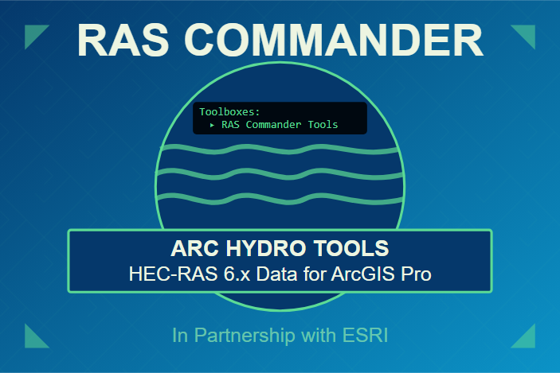

# RAS Commander Arc Hydro Tools

{ style="width: 67%; height: auto; display: block; margin-inline: auto;" }

## Get RAS Commander Arc Hydro Tools

RAS Commander Arc Hydro Tools is distributed with **Arc Hydro Tools for ArcGIS Pro**. Get the
current release directly from Esri, then open **RAS Commander Tools** from the Arc Hydro toolbox in
ArcGIS Pro.

[Download the latest Arc Hydro Tools from Esri](https://www.esri.com/en-us/industries/water-resources/arc-hydro/downloads#arc-hydro-for-arcgis-pro){ .md-button .md-button--primary }
[Read the installation guide](installation.md){ .md-button }

!!! note "This guide covers the ArcGIS Pro toolbox"
    RAS Commander Arc Hydro Tools exposes a focused set of RAS Commander capabilities inside
    ArcGIS Pro. For Python automation, plan execution, HDF analysis, and the complete RAS Commander
    API, use the [full RAS Commander guide](https://rascommander.info/ras/).

RAS Commander Arc Hydro Tools reads HEC-RAS 6.x project data directly and creates ArcGIS Pro
layers for 1D geometry, 2D geometry, summary results, pipe networks, and terrain. It is intended
for hydraulic engineers and GIS professionals who need reviewable GIS outputs without an
intermediate export workflow.

## What this guide covers

- Installing or adding the toolbox in ArcGIS Pro.
- Selecting the correct HEC-RAS input file for each tool.
- Running each of the five tools and understanding every parameter.
- Interpreting output feature classes, names, fields, dates, and units.
- Checking coordinate systems, feature counts, results, and terrain limitations.
- Diagnosing missing HDF groups, missing VRT files, and large-mesh performance issues.

## Available tools

| Tool | Primary use |
| --- | --- |
| [Load HEC-RAS 1D Geometry Layers](tools/load-1d-geometry.md) | Extract cross sections, river centerlines, bank and edge lines, and 1D structures. |
| [Load HEC-RAS 2D Geometry Layers](tools/load-2d-geometry.md) | Extract 2D flow areas, mesh components, breaklines, boundary-condition lines, and pipe networks. |
| [Load HEC-RAS 2D Results Summary Layers](tools/load-2d-results.md) | Create maximum WSE and maximum face-velocity point layers from a computed plan. |
| [Load HEC-RAS Terrain](tools/load-terrain.md) | Add the base terrain VRTs referenced by a project's `.rasmap` file to the active map. |
| [Organize HEC-RAS Project](tools/organize-project.md) | Batch-extract the available geometry and summary results for one plan or a project folder. |

## Recommended path

1. [Install and verify the toolbox](installation.md).
2. Follow the [quick start](quick-start.md) to identify the right input and output strategy.
3. Use [Choose a tool](features.md) to select a focused or batch workflow.
4. Complete the [validation checklist](reference/validation.md) before relying on or sharing the GIS outputs.

## Project resources

- [Source code and issue tracker](https://github.com/gpt-cmdr/ras-commander-hydro)
- [Full RAS Commander documentation](https://rascommander.info/ras/)
- [Esri Arc Hydro downloads](https://www.esri.com/en-us/industries/water-resources/arc-hydro/downloads)
- [CLB Engineering Corporation](https://clbengineering.com/)

The toolbox is free and open source under the MIT License. It was developed by CLB Engineering
Corporation in partnership with Esri for integration with the Arc Hydro Tools framework.
