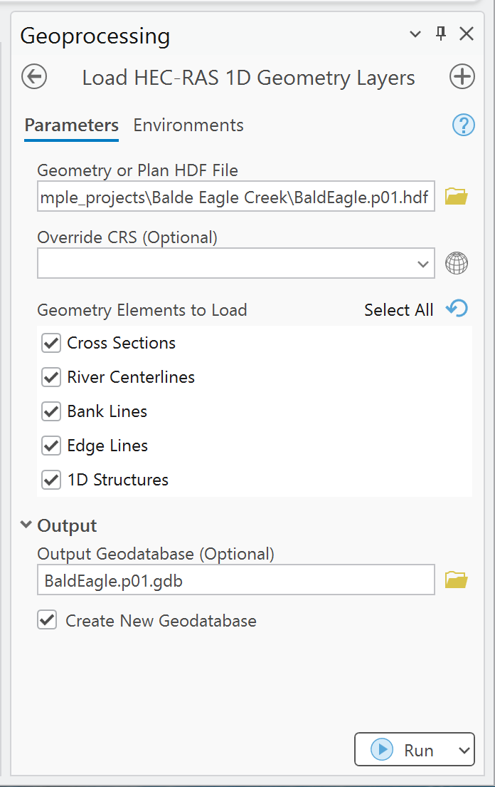

# Load HEC-RAS 1D Geometry Layers

Use this tool to create ArcGIS feature classes from supported 1D geometry stored in a HEC-RAS
geometry or plan HDF file.

## Before you run it

- Select a `g*.hdf` or `p*.hdf` that contains 1D geometry.
- Prefer a plan HDF when the output must be clearly associated with a specific plan.
- Confirm the project coordinate system in HEC-RAS/RAS Mapper.
- Choose a writable file geodatabase for durable output.

## Parameters

| Parameter | Required | Behavior |
| --- | --- | --- |
| **Geometry or Plan HDF File** | Yes | Reads supported geometry from a HEC-RAS `g*.hdf` or `p*.hdf`. |
| **Override CRS** | No | Used only when the tool cannot determine a projection from the project context. It does not reproject a detected CRS. |
| **Geometry Elements to Load** | Yes | Multi-select list. Defaults to **Cross Sections** and **River Centerlines**. |
| **Output Cross Sections** | Conditional | Enabled when cross sections are selected. Default is `memory\CrossSections`. |
| **Output River Centerlines** | Conditional | Enabled when river centerlines are selected. |
| **Output Bank Lines** | Conditional | Enabled when bank lines are selected. |
| **Output Edge Lines** | Conditional | Enabled when edge lines are selected. |
| **Output 1D Structures** | Conditional | Enabled when 1D structures are selected. |
| **Output Geodatabase** | No | Destination file geodatabase. With automatic creation, defaults beside the HDF as `Project.pXX.gdb`. |
| **Create New Geodatabase** | No | Enabled by default. Creates/reuses the named geodatabase and writes outputs to a plan feature dataset. |

## Procedure

1. Open **Load HEC-RAS 1D Geometry Layers**.
2. Select the geometry or plan HDF.
3. If the tool reports that the CRS cannot be determined, set **Override CRS** to the confirmed
   project coordinate system.
4. Select only the elements needed for the current review.
5. Keep **Create New Geodatabase** enabled for persistent output, or explicitly set each output.
6. Run the tool and review the geoprocessing messages.
7. Confirm the output location, coordinate system, feature count, and spatial alignment.

## Outputs

| Selection | Geometry | Feature class in organized output | Key fields |
| --- | --- | --- | --- |
| Cross Sections | Polyline | `CrossSections` | `xs_id`, `River`, `Reach`, `RS`, bank stations, reach lengths, `StationElevation`, `ManningsN` |
| River Centerlines | Polyline | `RiverCenterlines` | `river_id`, `RiverName`, `ReachName`, `USType`, `DSType` |
| Bank Lines | Polyline | `BankLines` | `bank_id`, `BankSide`, `Length` |
| Edge Lines | Polyline | `EdgeLines` | `edge_id`, `EdgeType`, `Length` |
| 1D Structures | Polyline | `Structures1D` | `struct_id`, `Type`, `River`, `Reach`, `RS`, `Description` |

`StationElevation` and `ManningsN` are text attributes in the GIS output. Use the source HEC-RAS
model or the full RAS Commander APIs when complete arrays or editing workflows are required.

## Interpretation notes

- The tool skips an element when its required HDF group/dataset is absent and reports a message.
- Structure support depends on geometry stored under the HEC-RAS `Geometry/Structures` HDF group.
- Output coordinates are assigned the detected/selected CRS; the tool does not transform source
  coordinates between CRSs.
- Geometry extraction is read-only. No HEC-RAS file is modified.

## Common checks

- Compare cross-section stationing and reach association with the Geometry editor.
- Check bank/edge-line orientation and extent against the terrain and centerline.
- Confirm that structure count and river station values match the intended geometry.
- If the output is empty, inspect [Troubleshooting](../troubleshooting.md#the-tool-completes-but-an-output-is-empty).

See [Outputs and naming](../reference/outputs.md) for geodatabase conventions.
