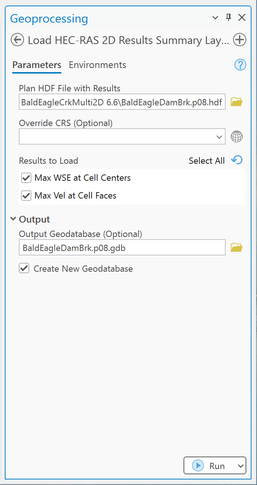

# Load HEC-RAS 2D Results Summary Layers

Use this tool to create GIS point layers for maximum water-surface elevation at 2D cell centers and
maximum velocity at cell-face centroids.

## Required input

Select a computed plan HDF such as `Project.p01.hdf`. A geometry HDF does not contain the required
summary results. The plan must contain the HEC-RAS unsteady 2D summary-output groups used by the
tool.

## Parameters

| Parameter | Required | Behavior |
| --- | --- | --- |
| **Plan HDF File with Results** | Yes | Reads summary results and the associated 2D geometry from `p*.hdf`. |
| **Override CRS** | No | Used only if automatic CRS detection fails; it does not reproject a detected CRS. |
| **Results to Load** | Yes | Select maximum WSE, maximum face velocity, or both. Defaults to maximum WSE. |
| **Output Max WSE at Cell Centers** | Conditional | Point output for each cell with a supported maximum WSE record. |
| **Output Max Vel at Cell Faces** | Conditional | Point output at each supported cell-face centroid. |
| **Output Geodatabase** | No | Persistent file geodatabase destination. |
| **Create New Geodatabase** | No | Enabled by default; creates/reuses `Project.pXX.gdb`. |

## Procedure

1. Confirm that the intended HEC-RAS plan computed successfully and that its HDF results are current.
2. Open **Load HEC-RAS 2D Results Summary Layers** and select the plan HDF.
3. Choose one or both result types.
4. Set **Override CRS** only if automatic detection fails.
5. Keep automatic geodatabase creation enabled for a persistent output.
6. Run the tool and review messages for each 2D flow area.
7. Compare several locations and values with RAS Mapper before using the layer for mapping or analysis.

## Output fields

| Output | Geometry | Fields |
| --- | --- | --- |
| `MaxWSE` | Point at cell center | `mesh_name`, `cell_id`, `max_wse`, `max_wse_time` |
| `MaxVelocity` | Point at cell-face centroid | `mesh_name`, `face_id`, `max_vel`, `time_of_max` |

The HDF summary datasets store a maximum value and the time offset at which it occurred. The tool
adds that offset to the simulation start time and writes an ArcGIS date field.

## Units and interpretation

- WSE and velocity remain in the source model's unit system. No conversion is performed.
- Maximum WSE and maximum face velocity are independent summaries; their timestamps need not match.
- Face velocity is represented at a point derived from the face geometry, not as a cell-average
  velocity polygon.
- The tool does not calculate depth, hazard classifications, inundation polygons, or full time series.
- Review unexpected sentinel/NoData values from the source HDF before symbolizing or calculating statistics.

## Common checks

- Confirm the plan number, simulation window, and compute status.
- Compare the number of WSE points with the available cell centers for each mesh.
- Compare sample maxima and times with RAS Mapper.
- Verify the model unit system before labeling legends or exporting tables.
- Confirm the CRS and layer alignment before raster interpolation or spatial joins.

For a broader result workflow, use the [full RAS Commander guide](https://rascommander.info/ras/).
