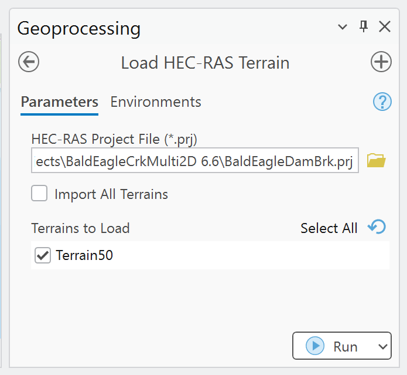

# Load HEC-RAS Terrain

Use this tool to add base terrain VRT layers referenced by a HEC-RAS project's `.rasmap` file to
the active ArcGIS Pro map.

!!! warning "Base terrain only"
    The tool loads the underlying VRT raster. It does not apply vector terrain modifications made
    in RAS Mapper, including terrain-modification breaklines or high-ground features.

## Required project files

The project folder must contain:

- The selected HEC-RAS project file, such as `Project.prj`.
- The associated `Project.rasmap` file.
- The terrain HDF and matching VRT path referenced by the `.rasmap` terrain layer.

Open the HEC-RAS project in RAS Mapper and verify the terrain if the `.rasmap` or VRT has not been
created.

## Parameters

| Parameter | Required | Behavior |
| --- | --- | --- |
| **HEC-RAS Project File (`*.prj`)** | Yes | Locates the same-base-name `.rasmap` file and reads its terrain definitions. |
| **Import All Terrains** | No | When enabled, loads every discovered terrain and disables the selection list. Defaults to off. |
| **Terrains to Load** | Conditional | Multi-select list populated from the `.rasmap` file. Required when **Import All** is off. |

## Procedure

1. Open an ArcGIS Pro project and activate a map view.
2. Open **Load HEC-RAS Terrain** and select the HEC-RAS `.prj` file.
3. Wait for the terrain list to populate.
4. Select one or more terrains, or enable **Import All Terrains**.
5. Run the tool and review the path reported for each missing or loaded VRT.
6. Confirm the raster extent, cell values, vertical units, and alignment with the model geometry.

## What the tool does

For each `<Terrains><Layer>` entry in the `.rasmap` file, the tool:

1. Resolves the referenced terrain path relative to the project folder.
2. Replaces the referenced terrain file extension with `.vrt`.
3. Checks that the VRT exists.
4. Adds the VRT to the active ArcGIS Pro map.

The tool does not copy the terrain, create a geodatabase raster, or repair broken `.rasmap` paths.

## Troubleshooting

- **No terrain list:** confirm that a same-name `.rasmap` file exists and contains terrain layers.
- **VRT not found:** open the terrain in RAS Mapper, confirm the referenced folder, and check that the
  matching `.vrt` is present.
- **No active map:** open a map view in ArcGIS Pro and rerun the tool.
- **Terrain draws in the wrong location:** validate the HEC-RAS terrain projection and the ArcGIS map
  coordinate system; loading the VRT does not repair incorrect georeferencing.
- **Terrain differs from RAS Mapper:** determine whether RAS Mapper vector terrain modifications are
  responsible. Those modifications are outside this tool's output.
